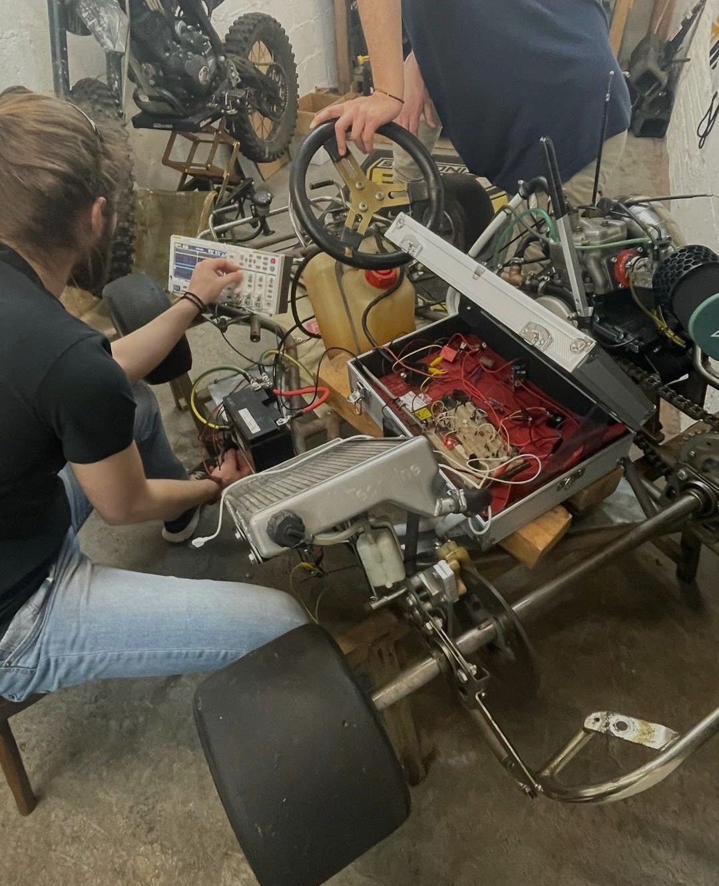
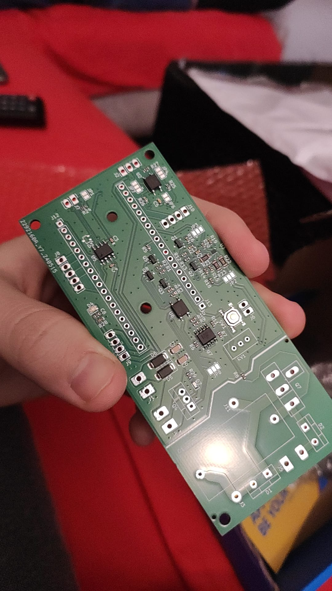
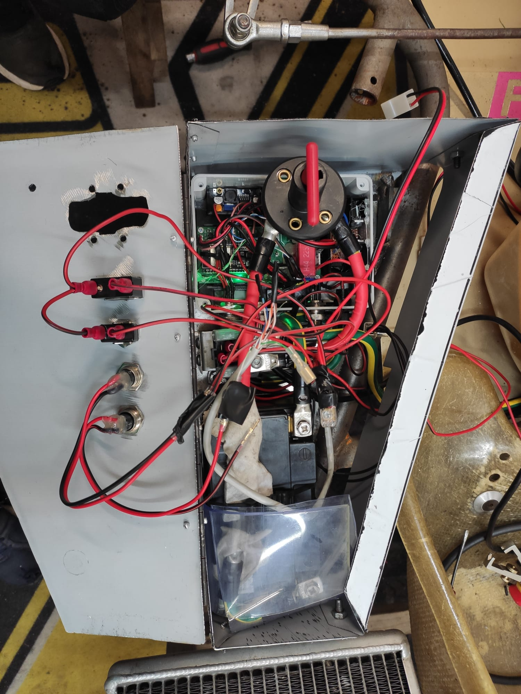
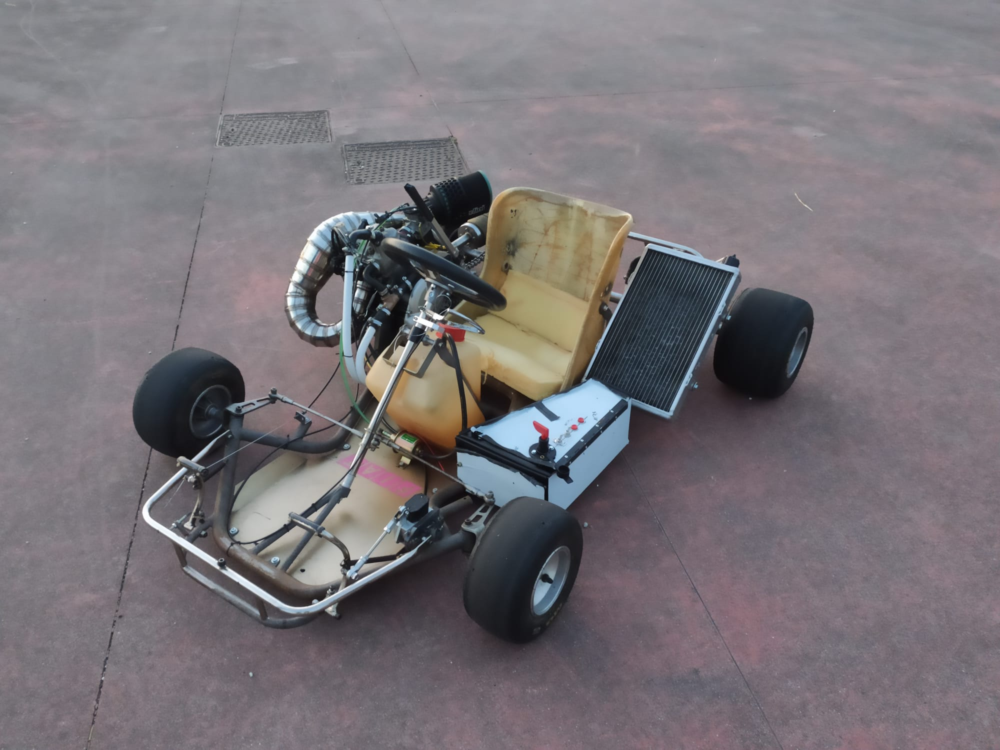

# Kart-CDI

WIP

A never-ending project involving three of the least brilliant minds in the world.

# Prototype

First attempt of creating a Capacitive Discharge Ignition unit required numerous and careful tweaks to not let the engine detonate and make a mess.
After careful planning the first prototype was a single board solution CNC machined and assembled by hand.
The board contains an high voltage supply, the CDI stage with voltage feedback, a 32bit microcontroller and the engine relay and exhaust valve controllers.
Unfortunately the challenging enviroment and extreme condition lead to a failure of the already poor quality whole assembly.

CDI p2
------

We decided to move the high voltage part outside of the board to reduce EMI and ensure reliability by printing the board with the help of an online manufacturer.
The second prototype unfortunately takes up significatly more space but it is planned to make it more compact in the future and cover it in resin.

Image gallery
-------------

